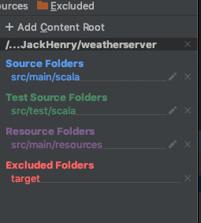
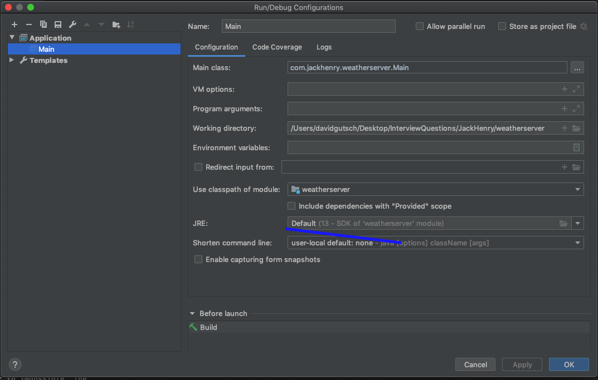

# weather-server
Weather server that uses the Open Weather API that exposes an endpoint that takes in lat/long coordinates. 

This repository was created using the following sbt new template:
[http4s/http4s.g8 ](https://github.com/http4s/http4s.g8)

## Setting up the repo

Intellij didn't correctly setup my root directory. In the event you have the same issue, this is how my modules are configured 
 

Here are my run configureations

## Testing the repo

As requested, I did not write any unit tests for this endpoint. However to test positive and negative cases for an alert being retrieved you can use the following lattitudes:

There is currently an Alert in Cody, Wyoming

[localhost:8080/forecast?lat=42.5263&long=-109.0565]()

There is not currently an alert in St. Petersburg, Florida. Since my relative temperature interpretation is golf related, Naturally one of my endpoint calls should be at a golf course.

[localhost:8080/forecast?lat=27.72964648187172&long=-82.66093295937623]()

You may also invoke this endpoint with your own API key as shown below:

[localhost:8080/forecast?lat=42.5263&long=-109.0565&appid=<< your key>]()